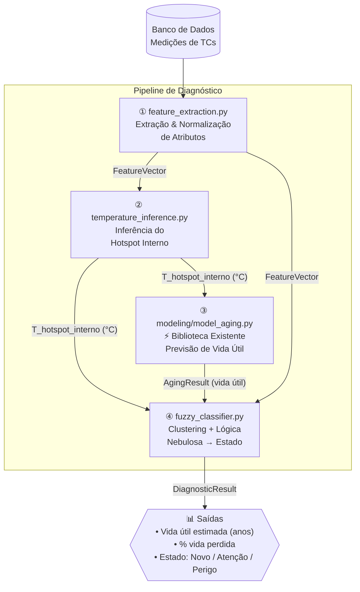

# Passo 1 — Planejamento da Arquitetura do Sistema de Diagnóstico de TCs

## 1. Visão Geral do Fluxo de Dados



---

## 2. Estrutura de Arquivos e Pastas

```
PeD-Power-Solis/
│
├── main.py                          # Ponto de entrada — orquestra o pipeline completo
│
├── modeling/                        # ✅ JÁ EXISTE — Não modificar
│   ├── model_aging.py               #    Cálculo de vida útil (regra de Montsinger)
│   ├── model_hotspot.py             #    Treino/inferência da temperatura hotspot
│   ├── Dados_Lab_245.ods            #    Dataset TC 245 kV
│   └── Dados_Lab_550.ods            #    Dataset TC 550 kV
│
├── preprocessing/                   # ✅ JÁ EXISTE — Expandir
│   ├── feature_extraction.py        #    🔄 REFATORAR: extração e engenharia de atributos
│   └── funcoes_envelhecimento       #    Fórmulas auxiliares de envelhecimento (FAA)
│
├── inference/                       # 🆕 NOVO PACOTE
│   ├── __init__.py
│   └── temperature_inference.py     #    Carrega modelo .pkl e infere hotspot interno
│
├── classification/                  # 🆕 NOVO PACOTE
│   ├── __init__.py
│   ├── fuzzy_classifier.py          #    Lógica nebulosa (scikit-fuzzy) → Novo/Atenção/Perigo
│   └── clustering.py                #    KMeans/DBSCAN para agrupamento dos TCs
│
├── pipeline/                        # 🆕 NOVO PACOTE — Orquestração
│   ├── __init__.py
│   └── diagnostic_pipeline.py      #    Classe DiagnosticPipeline: une todos os módulos
│
├── models/                          # 🆕 Modelos treinados (.pkl) persistidos
│   └── .gitkeep
│
├── scripts/
│   └── testes da biblioteca/
│       └── teste_preprocessamento.py
│
└── Pipfile
```

---

## 3. Responsabilidade de Cada Módulo

| Módulo | Responsabilidade | Entradas | Saídas |
|---|---|---|---|
| `preprocessing/feature_extraction.py` | Valida, limpa e engenharia atributos das medições brutas. Calcula capacitância, perda dielétrica, tendências temporais e normalização. | `dict` / `DataFrame` bruto do BD | `FeatureVector` (dataclass) |
| `inference/temperature_inference.py` | Wrapper sobre `model_hotspot.py`. Carrega o modelo `.pkl` e retorna T_hotspot inferida. | `FeatureVector` | `float` (°C) |
| `modeling/model_aging.py` | ✅ Existente. Calcula vida útil pela regra de Montsinger (Base 2). | `T_hotspot` + `horas_operacao` | `AgingResult` (dict) |
| `classification/clustering.py` | Agrupa amostras históricas de TCs via KMeans. Identifica centróides para ancoragem do estado. | `DataFrame` com múltiplas medições | Labels de cluster, centróides |
| `classification/fuzzy_classifier.py` | Usa lógica nebulosa (Mamdani) sobre 4 variáveis para mapear o estado do equipamento. | `FeatureVector` + `T_hotspot` + `vida_util_anos` | `str` (Novo/Atenção/Perigo) + `float` (score) |
| `pipeline/diagnostic_pipeline.py` | Orquestra todos os módulos em sequência. Interface única para o `main.py`. | Medição bruta + configurações | `DiagnosticResult` (dataclass) |

---

## 4. Abordagens Matemáticas Propostas

### 4.1 Inferência de Temperatura (Hotspot Interno)
**Abordagem:** **Regressão Polinomial** (já implementada em `model_hotspot.py`)

O modelo é treinado com os dados de laboratório (`.ods`) e mapeia:
$$f(\text{Tg}(\delta),\ I_{primário},\ T_{amb},\ T_{ext}) \rightarrow T_{hotspot}$$

- **Por quê polinomial?** Os fenômenos térmicos de TC têm comportamento não-linear moderado. O `model_hotspot.py` já implementa seleção automática de grau via cross-validation, sendo robusto para datasets pequenos.
- **Alternativa futura:** GPR (Gaussian Process Regression) para intervalos de confiança ou SVR com kernel RBF.

### 4.2 Cálculo de Vida Útil
**Abordagem:** **Regra de Montsinger (Base 2)** — já implementada em `model_aging.py`

$$L(\theta_p) = L_{ref} \cdot 2^{-(\theta_p - \theta_{ref})/p}$$

- `temp_ref = 85°C`, `vida_ref = 25 anos`, `p = 8°C` (padrão da norma IEC para TCs de papel impregnado).

### 4.3 Agrupamento (Clustering)
**Abordagem:** **K-Means com K=3** (correspondendo a Novo, Atenção, Perigo)

O espaço de features normalizado é agrupado em 3 clusters. Os centróides são determinados por uma inicialização semi-supervisionada (seeded centroids), usando os valores típicos das normas técnicas:

| Estado | Tg(δ) ref | Vida restante (anos) ¹ | Hotspot ref |
|---|---|---|---|
| Novo | < 0,5% | > 17,5 anos | < 70°C |
| Atenção | 0,5–0,8% | 7,5–17,5 anos | 70–90°C |
| Perigo | > 0,8% | < 7,5 anos | > 90°C |

> ¹ Valores em **anos** conforme retorno de `calcular_perda_vida_util_base2()` → chave `expectativa_vida_atual_anos`. Os limiares acima assumem uma vida de referência de 25 anos (70% = 17,5 a; 30% = 7,5 a).

### 4.4 Lógica Nebulosa (Fuzzy Logic — Mamdani)
**Biblioteca:** `scikit-fuzzy`

**Variáveis linguísticas de entrada:**
1. **Tangente de perdas** → {Baixa [<0,5%], Média [0,5–0,8%], Alta [>0,8%]}
2. **Temperatura hotspot inferida** → {Normal [<70°C], Elevada [70–90°C], Crítica [>90°C]}
3. **Vida útil estimada (anos)** → {Alta [>17,5a], Média [7,5–17,5a], Baixa [<7,5a]} ¹
4. **Fator de aceleração de envelhecimento (FAA)** → {Baixo, Moderado, Alto}

> ¹ Limiares baseados em `expectativa_vida_atual_anos` (saída direta de `model_aging.py` em **anos**).

**Variável linguística de saída:**
- **Estado operacional** → {Novo [0–33], Atenção [33–66], Perigo [66–100]}

**Base de regras (exemplos):**
- SE `tg` É Baixa E `hotspot` É Normal E `vida_util` É Alta → Estado É **Novo**
- SE `tg` É Média E `hotspot` É Elevada → Estado É **Atenção**
- SE `tg` É Alta OU `hotspot` É Crítica OU `vida_util` É Baixa → Estado É **Perigo**

**Defuzzificação:** Método do centróide (Center of Gravity — CoG).

---

## 5. Estruturas de Dados (Dataclasses)

```python
# pipeline/diagnostic_pipeline.py

@dataclass
class MedicaoBruta:
    """Entrada do banco de dados — uma linha de medição."""
    tangente_perdas: float       # Tg(δ) em %
    corrente: float              # Corrente primária em A
    temperatura_ambiente: float  # °C
    ponto_quente_externo: float  # °C (medido externamente por câmera IR)
    horas_operacao: float        # Horas acumuladas de operação
    tensao_nominal: float        # kV (para seleção do modelo: 245 ou 550 kV)

@dataclass
class FeatureVector:
    """Atributos extraídos e calculados a partir da medição bruta."""
    tangente_perdas: float
    corrente: float
    temperatura_ambiente: float
    ponto_quente_externo: float
    capacitancia: float          # Derivada
    perda_dieletrica: float      # Derivada
    horas_operacao: float

@dataclass
class DiagnosticResult:
    """Saída completa do pipeline de diagnóstico."""
    temperatura_hotspot_inferida_C: float
    expectativa_vida_anos: float
    percentual_vida_perdida: float
    fator_aceleracao: float
    estado_operacional: str      # "Novo", "Atenção" ou "Perigo"
    score_fuzzy: float           # Score numérico [0–100]
    cluster_id: int              # Identificador do grupo (0, 1, 2)
```

---

## 6. Dependências Python Necessárias

| Biblioteca | Uso | Status |
|---|---|---|
| `numpy` | Cálculos numéricos | ✅ Já usado |
| `pandas` | Manipulação de dados | ✅ Já usado |
| `scikit-learn` | Regressão polinomial, KMeans, normalização | ✅ Já usado |
| `joblib` | Serialização de modelos | ✅ Já usado |
| `scikit-fuzzy` | Lógica nebulosa (Mamdani) | 🆕 Adicionar |
| `odfpy` | Leitura de arquivos `.ods` | ✅ Já usado (via pandas) |

```bash
# Instalação da nova dependência
pipenv install scikit-fuzzy
```

---

## 7. Fluxo de Execução em `main.py`

```python
from pipeline.diagnostic_pipeline import DiagnosticPipeline, MedicaoBruta

pipeline = DiagnosticPipeline(
    caminho_modelo_pkl="models/modelo_hotspot_550kV.pkl"
)

medicao = MedicaoBruta(
    tangente_perdas=0.7,
    corrente=2000.0,
    temperatura_ambiente=30.0,
    ponto_quente_externo=45.0,
    horas_operacao=87600.0,   # 10 anos de operação
    tensao_nominal=550.0
)

resultado = pipeline.executar(medicao)

print(f"Hotspot inferido : {resultado.temperatura_hotspot_inferida_C:.1f} °C")
print(f"Vida útil estim. : {resultado.expectativa_vida_anos:.1f} anos")
print(f"Vida perdida     : {resultado.percentual_vida_perdida:.2f} %")
print(f"Estado           : {resultado.estado_operacional}")
```

---

> [!IMPORTANT]
> **Aguardando validação do Passo 1 antes de prosseguir para o Passo 2.**
> Confirme se as abordagens propostas (Regressão Polinomial, K-Means seeded + Fuzzy Mamdani) estão alinhadas com os requisitos do projeto, e se a estrutura de pastas proposta faz sentido para o contexto do PeD-Power-Solis.
