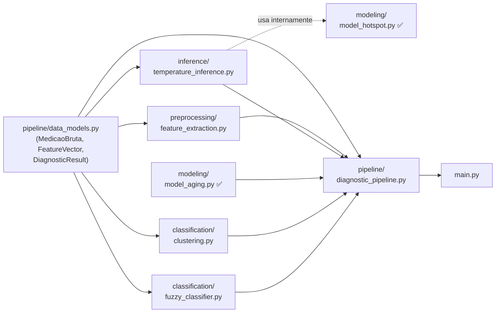

# Passo 2 — Esqueleto das Bibliotecas (Stubs)

> [!IMPORTANT]
> Todas as correções do Passo 1 foram incorporadas:
> - Vida útil como **anos** (`expectativa_vida_atual_anos`) — não percentual
> - Tg(δ) **> 0,8% = Perigo** (antes era > 1,0%)

---

## Estrutura Final de Arquivos Criados

```
PeD-Power-Solis/
│
├── main.py                              ✅ Atualizado (stub com imports corretos)
│
├── modeling/
│   ├── __init__.py                      🆕 Criado (corrige ModuleNotFoundError)
│   ├── model_aging.py                   ✅ Existente — não modificado
│   └── model_hotspot.py                 ✅ Existente — não modificado
│
├── preprocessing/
│   ├── __init__.py                      🆕 Criado
│   └── feature_extraction.py            🔄 Refatorado (stub com dataclasses)
│
├── inference/
│   ├── __init__.py                      🆕 Criado
│   └── temperature_inference.py         🆕 Criado (stub)
│
├── classification/
│   ├── __init__.py                      🆕 Criado
│   ├── clustering.py                    🆕 Criado (stub)
│   └── fuzzy_classifier.py              🆕 Criado (stub)
│
├── pipeline/
│   ├── __init__.py                      🆕 Criado
│   ├── data_models.py                   🆕 Criado (dataclasses)
│   └── diagnostic_pipeline.py          🆕 Criado (stub)
│
└── models/
    └── .gitkeep                         🆕 Criado (armazena .pkl treinados)
```

---

## Módulo 1 — `pipeline/data_models.py`
### Contratos de Dados (Dataclasses)

| Classe | Papel no Pipeline | Campos Principais |
|---|---|---|
| `MedicaoBruta` | **Entrada** do pipeline | `tangente_perdas`, `corrente`, `temperatura_ambiente`, `ponto_quente_externo`, `horas_operacao`, `tensao_nominal` |
| `FeatureVector` | **Intermediário** (①→②③④) | Campos acima + `capacitancia`, `perda_dieletrica` |
| `DiagnosticResult` | **Saída** do pipeline | `temperatura_hotspot_inferida_C`, `expectativa_vida_anos`¹, `fator_aceleracao`, `percentual_vida_perdida`, `estado_operacional`, `score_fuzzy`, `cluster_id` |

> ¹ Em **anos**, direto da chave `expectativa_vida_atual_anos` de `model_aging`.

---

## Módulo 2 — `preprocessing/feature_extraction.py`
### Assinaturas

```python
def calcular_capacitancia(
    tg: float,
    rms_corrente: float,
    rms_tensao: float,
) -> float: ...

def calcular_perda_dieletrica(
    tg: float,
    rms_corrente: float,
    rms_tensao: float,
) -> float: ...

def validar_medicao(medicao: MedicaoBruta) -> None: ...

def extrair_features(
    medicao: MedicaoBruta,
    tensao_ensaio_V: float = 10_000.0,
) -> FeatureVector: ...
```

**Entrada:** `MedicaoBruta` | **Saída:** `FeatureVector`

---

## Módulo 3 — `inference/temperature_inference.py`
### Assinaturas

```python
class HotspotInferenceModel:
    def __init__(self, caminho_modelo_pkl: str) -> None: ...
    def inferir(self, features: FeatureVector) -> float: ...

    @property
    def caminho_modelo(self) -> str: ...

def inferir_hotspot(
    features: FeatureVector,
    caminho_modelo_pkl: str,
) -> float: ...
```

**Entrada:** `FeatureVector` + path do `.pkl`
**Saída:** `float` (temperatura em °C)
**Dependência:** `modeling.model_hotspot.inferir_temperatura`

---

## Módulo 4 — `classification/clustering.py`
### Assinaturas

```python
# Centróides normativos (não normalizados):
CENTROIDES_INICIAIS_RAW = np.array([
    [0.30, 60.0, 22.0],   # Cluster 0 → Novo
    [0.65, 80.0, 12.0],   # Cluster 1 → Atenção
    [1.20, 100.0,  4.0],  # Cluster 2 → Perigo
])

class TCClusteringModel:
    def __init__(self, n_clusters: int = 3, random_state: int = 42) -> None: ...

    def treinar(self, df_historico: pd.DataFrame) -> "TCClusteringModel": ...

    def prever_cluster(
        self,
        temperatura_hotspot_C: float,
        expectativa_vida_anos: float,   # ← em ANOS
        tangente_perdas: float,
    ) -> int: ...                       # 0=Novo, 1=Atenção, 2=Perigo

    def salvar(self, caminho_pkl: str) -> None: ...

    @classmethod
    def carregar(cls, caminho_pkl: str) -> "TCClusteringModel": ...
```

---

## Módulo 5 — `classification/fuzzy_classifier.py`
### Variáveis Linguísticas e Funções de Pertinência

| Variável | Termos | Limiares |
|---|---|---|
| `tg` (Tg(δ) em %) | baixa / média / alta | < 0,5 / 0,5–0,8 / **> 0,8** |
| `hotspot` (°C) | normal / elevada / crítica | < 70 / 70–90 / > 90 |
| `vida` (anos) | alta / média / baixa | > 17,5 / 7,5–17,5 / < 7,5 |
| `faa` | baixo / moderado / alto | < 1,5 / 1,5–3,0 / > 3,0 |
| **`estado`** (saída) | **novo / atenção / perigo** | **0–33 / 33–66 / 66–100** |

### Base de Regras (10 regras Mamdani)

| # | SE | ENTÃO |
|---|---|---|
| R1 | tg=baixa **E** hotspot=normal **E** vida=alta | estado=**novo** |
| R2 | tg=média **E** hotspot=elevada | estado=**atenção** |
| R3 | tg=**alta** | estado=**perigo** |
| R4 | hotspot=**crítica** | estado=**perigo** |
| R5 | vida=**baixa** | estado=**perigo** |
| R6 | tg=baixa **E** hotspot=elevada | estado=**atenção** |
| R7 | tg=média **E** vida=média | estado=**atenção** |
| R8 | faa=alto **E** vida=média | estado=**atenção** |
| R9 | faa=alto **E** tg=alta | estado=**perigo** |
| R10 | tg=baixa **E** vida=alta **E** hotspot=normal | estado=**novo** |

### Assinaturas

```python
class FuzzyTCClassifier:
    def __init__(self) -> None: ...
    def _criar_variaveis_linguisticas(self) -> None: ...
    def _definir_funcoes_pertinencia(self) -> None: ...
    def _definir_regras(self) -> None: ...

    def classificar(
        self,
        tangente_perdas: float,
        temperatura_hotspot_C: float,
        expectativa_vida_anos: float,   # ← em ANOS
        fator_aceleracao: float,
    ) -> Tuple[str, float]: ...         # ("Novo"|"Atenção"|"Perigo", score)

    @staticmethod
    def score_para_estado(score: float) -> str: ...
```

---

## Módulo 6 — `pipeline/diagnostic_pipeline.py`
### Assinaturas

```python
class DiagnosticPipeline:
    def __init__(
        self,
        caminho_modelo_hotspot: str,
        caminho_modelo_clustering: Optional[str] = None,
        tensao_ensaio_V: float = 10_000.0,
        vida_ref_anos: float = 25.0,
        temp_ref_C: float = 85.0,
        p_montsinger: float = 8.0,
    ) -> None: ...

    def executar(self, medicao: MedicaoBruta) -> DiagnosticResult: ...

    def executar_lote(self, df_medicoes: pd.DataFrame) -> pd.DataFrame: ...

    def treinar_clustering(
        self,
        df_historico: pd.DataFrame,
        salvar_em: Optional[str] = None,
    ) -> None: ...
```

---

## Mapa de Dependências entre Módulos



---

## Dependência Nova — Instalação do scikit-fuzzy

```bash
pipenv install scikit-fuzzy
```

> [!NOTE]
> `scikit-fuzzy` é a única dependência nova. Todas as outras (`numpy`, `pandas`, `scikit-learn`, `joblib`) já estão presentes no `Pipfile`.

---

> [!IMPORTANT]
> **Aguardando validação do Passo 2 antes de prosseguir para o Passo 3 (Codificação).**
> Confirme se as assinaturas, tipos e a base de regras fuzzy estão corretos para que eu implemente a lógica completa.
